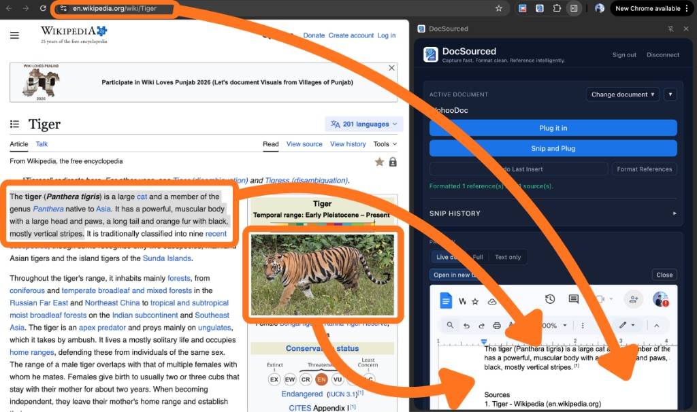
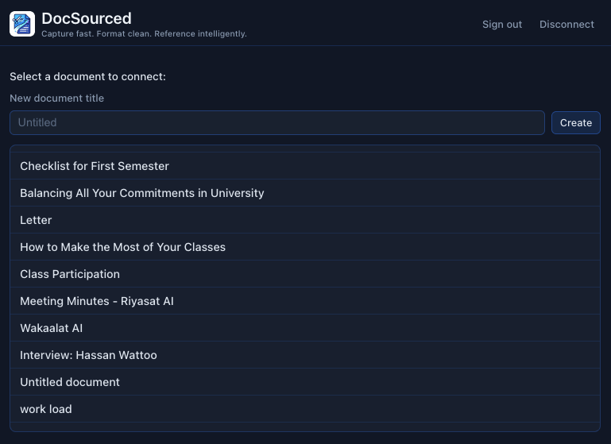
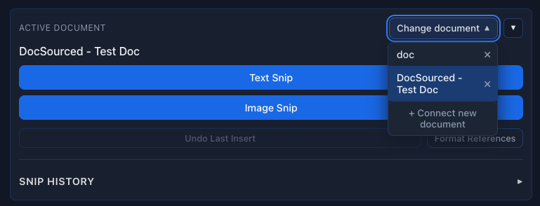
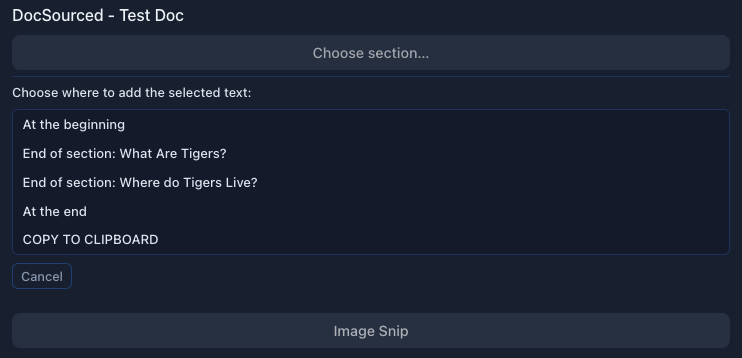
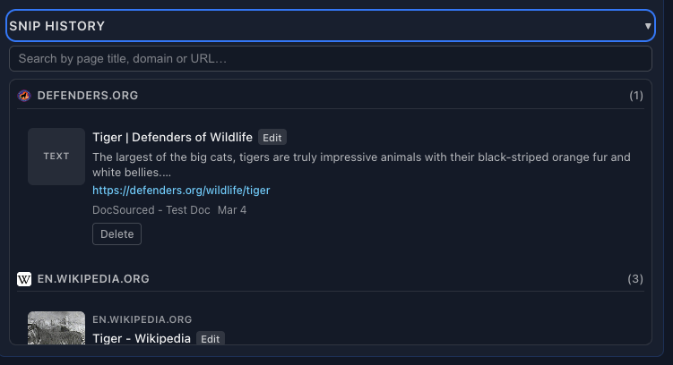
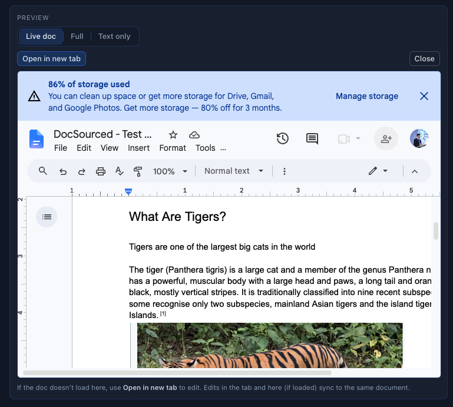
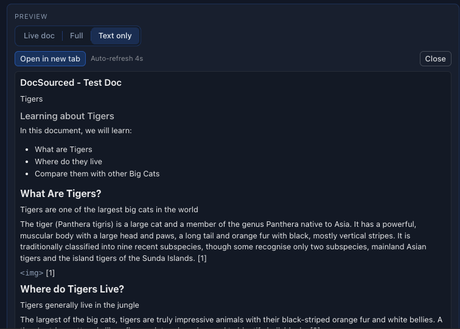
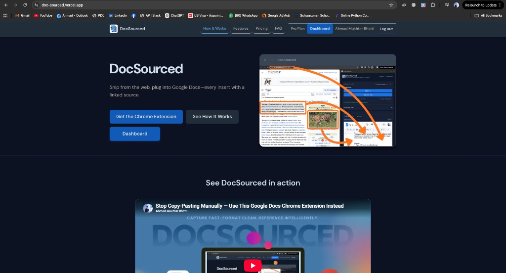

# DocSourced

**Capture fast. Format clean. Reference intelligently.**

DocSourced is a Chrome extension (and companion website) that lets researchers and students **snip text or images from any webpage** and **plug them straight into a connected Google Doc**—each insert carrying a clean, hyperlinked source. No more messy copy-paste, broken formatting, or hunting down URLs after the fact.

🌐 **Website:** [https://doc-sourced.vercel.app/](https://doc-sourced.vercel.app/)  
🧩 **Chrome Web Store:** [DocSourced](https://chromewebstore.google.com/detail/hjljflbabckeaicedbbkaobjkhkkafjf)

---

## Who it’s for

Writing a paper, literature review, or research notes usually means:

1. Finding a useful paragraph or figure on the web  
2. Copying it into Google Docs  
3. Manually adding the source URL / citation  
4. Repeating that dozens of times  

That **grunt work**—copy-pasting research *and* keeping every reference straight—breaks focus and wastes time. DocSourced is built for **students, researchers, and professionals** who want the content in the doc *and* the source attached, without leaving their reading flow.

---

## What it does (at a glance)

| Capability | Description |
|---|---|
| **Connect Google Docs** | Sign in with Google and link one or more docs as your research workspace |
| **Text & image snips** | Capture selected text or an image from any page |
| **Plug with sources** | Insert into a chosen section of your doc with a linked source line |
| **Undo last insert** | Remove the most recent plug (including its source) in one click |
| **Snip History** | Browse past snips by domain; reinsert or manage sources |
| **Live doc preview** | Preview your Google Doc inside the extension (Live / Full / Text only) |
| **Format References (Pro)** | Turn inline source markers into superscript citations and a Sources section at the bottom |

---

## How it works

### 1. The idea: snip from the web → plug into your doc

From any page (e.g. Wikipedia), DocSourced can pull the **page URL**, a **text selection**, and/or an **image**, then place them into your Google Doc with the source preserved.



---

### 2. Sign in with Google & select a document

After signing in (Google SSO), pick which Google Doc to connect—or create a new one from the extension.



---

### 3. Choose an active document, then snip text or an image

With a doc connected, use the **Change document** dropdown to switch docs (Pro supports multiple). Use **Text Snip** or **Image Snip** to capture content from the current page.



---

### 4. Choose where to plug the snip

After selecting text (or capturing an image), DocSourced lists insertion points—**at the beginning**, **end of a section** (using your doc’s headings), **at the end**, or **copy to clipboard**—so research lands in the right place, not dumped at the bottom of the file.



---

### 5. Snip History — sources organized by domain

**Snip History** groups everything you’ve plugged in by **source domain**, shows how many references come from each site (text and images), keeps links back to the original URLs, and lets you **reinsert** a snip you’ve used before.



---

### 6. Live Google Doc preview (inside the extension)

Preview your connected doc without leaving the sidebar: **Live doc**, **Full**, or **Text only**, plus **Open in new tab**. Edits stay synced to the same Google Doc.



---

### 7. Text-only preview

A lighter, structure-focused view of headings, body text, lists, and citation markers (e.g. `[1]`)—useful for checking narrative flow and reference placement at a glance.



---

## Format References (Pro)

The **Format References** button scans the connected Google Doc for source markers, then:

1. Replaces inline source lines with **superscript citation numbers** (e.g. `[1]`)  
2. **Deduplicates** sources by URL  
3. Builds a consolidated **Sources** section at the bottom of the document  

That’s the path from “messy research notes” to something closer to publication-ready citations—without reformatting by hand. Format References is a **Pro** feature.

---

## Website & subscriptions

The marketing and account site lives at **[https://doc-sourced.vercel.app/](https://doc-sourced.vercel.app/)**.



On the site you can:

- Learn how the product works (demo video, features, FAQ)  
- Sign in with Google  
- View **Free vs Pro** pricing  
- Open the **Dashboard** to manage your account and subscription  

### Plans (high level)

| | Free | Pro |
|---|---|---|
| Snips | Limited monthly allowance | Unlimited |
| Connected docs | One | Multiple |
| Insert with source links | ✓ | ✓ |
| Undo last insert | ✓ | ✓ |
| Snip History / sources panel | Limited | Full |
| Format References | — | ✓ |

---

## Tech stack & architecture

| Layer | Role |
|---|---|
| **Chrome extension** (`frontend/`) | React + Vite popup UI; Google Docs API; snip capture & insert |
| **Website** (`website/`) | React + Vite landing page, auth, dashboard, pricing (deployed on Vercel) |
| **Supabase** | Auth (Google OAuth), Postgres (`profiles`, `subscriptions`, snip history), storage, Edge Functions |
| **Stripe** | Pro subscriptions (Checkout), Billing Portal, webhooks that sync plan status to Supabase |

### Supabase (backend)

- **Authentication** — Same Google identity for the extension and the website  
- **Database** — Profiles (tier: `free` / `pro`), subscriptions, snip history metadata  
- **Edge Functions** — e.g. `create-checkout-session`, `create-billing-portal-session`, `stripe-webhook`, `get-user-subscription`, `validate-access` so **tier and billing stay server-verified** (extension and site stay in sync when someone upgrades or cancels)

### Stripe (subscriptions)

- Users upgrade via **Stripe Checkout** from the website  
- **Billing Portal** for cancel / payment method / invoices  
- **Webhooks** update `subscriptions` and `profiles.tier` in Supabase so Pro features unlock (or lock) correctly in both the website and the extension  

---

## Repository layout

```
├── frontend/          # Chrome extension (React + Vite)
├── website/           # Marketing site + dashboard (React + Vite → Vercel)
├── supabase/          # Migrations + Edge Functions
├── backend/           # Supporting backend config (if used locally)
└── docs/images/       # Screenshots used in this README
```

---

## Getting started (developers)

### Extension (`frontend/`)

```bash
cd frontend
npm install
# Configure .env (Supabase URL/anon key, Google OAuth client IDs — see frontend/README.md)
npm run build
# Load frontend/build (or dist) as an unpacked extension in chrome://extensions
```

### Website (`website/`)

```bash
cd website
npm install
# Configure .env with VITE_SUPABASE_URL and VITE_SUPABASE_ANON_KEY
npm run dev
```

### Supabase & Stripe

Set Edge Function secrets (e.g. `STRIPE_SECRET_KEY`, `STRIPE_PRO_PRICE_ID`, webhook signing secret, `SITE_URL`) and deploy functions as documented under `supabase/functions/README.md`.

---

## Links

| Resource | URL |
|---|---|
| Website | https://doc-sourced.vercel.app/ |
| Privacy Policy | https://doc-sourced.vercel.app/privacy |
| Terms of Service | https://doc-sourced.vercel.app/terms |
| Chrome Web Store | https://chromewebstore.google.com/detail/hjljflbabckeaicedbbkaobjkhkkafjf |

---

## License / contact

Offered by **ahmadmukhtar2001**. For product or privacy questions: [ahmadmukhtar2001@gmail.com](mailto:ahmadmukhtar2001@gmail.com).
